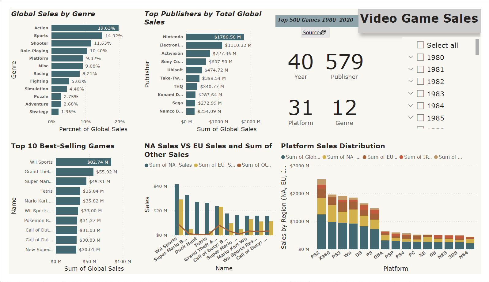

# 🎮 Power BI Video Game Sales Dashboard

The "Video Game Sales Analysis" Power BI dashboard offers a dynamic and visual exploration of historical video game sales figures. It aims to answer key questions such as:
- Which genres are most popular globally?
- Who are the leading publishers in terms of sales?
- How do sales vary across different gaming platforms?
- What are the regional contributions to global sales?
- Which games are the best-sellers?

---

## 📊 Dashboard Overview

This dashboard includes:

- **Top 10 Best-Selling Video Games**
- **Global Sales by Genre** (% distribution)
- **Top Publishers by Total Global Sales**
- **Platform Sales Distribution Across Regions (NA, EU, JP, Other)**
- **NA vs EU vs Other Regional Sales Comparison**
- **Interactive Year and Genre Filters**
- **Drill-Down Enabled** – Click to explore deeper layers of data (e.g., platform > game-name)

---

## 📂 Dataset

- **Source:** [Kaggle - Video Game Sales Dataset](https://www.kaggle.com/datasets/anandshaw2001/video-game-sales)
- **Covers**: 
    * `Rank`: Ranking of games by global sales.
    * `Name`: Name of the video game.
    * `Platform`: Gaming platform (e.g., PS2, X360, Wii).
    * `Year`: Year of release.
    * `Genre`: Game genre (e.g., Action, Sports, Role-Playing).
    * `Publisher`: Game publisher.
    * `NA_Sales`: Sales in North America (in millions).
    * `EU_Sales`: Sales in Europe (in millions).
    * `JP_Sales`: Sales in Japan (in millions).
    * `Other_Sales`: Sales in other regions (in millions).
    * `Global_Sales`: Total global sales (in millions).

---

## 🛠️ Tools Used

- **Power BI Desktop**
- **Kaggle CSV Dataset**

---

## 🔍 Key Insights

- **Nintendo** leads global sales by publisher.
- **Action** and **Sports** are the top-performing genres.
- **Wii Sports** is the highest-selling game with over 82 million units sold.
- **Wii**, **DS**, and **PS2** dominate platform sales globally.
- **North America** consistently shows higher sales than other regions.

---

## 📁 Files in This Repo

- `video_game_sales.pbix` – The Power BI dashboard file
- `README.md` – Documentation
- `pdf_image.png` – Screenshot of the dashboard

---

## 🚀 How to Use

1. Download or clone this repository.
2. Open `video_game_sales.pbix` in Power BI Desktop.
3. Use slicers and drill-down features to explore insights interactively.
4. Modify and build upon the report as needed.

---

## 📄 License

This project is licensed under the [MIT License](LICENSE).